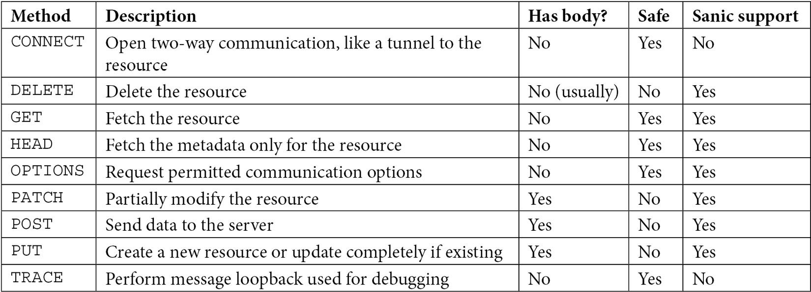
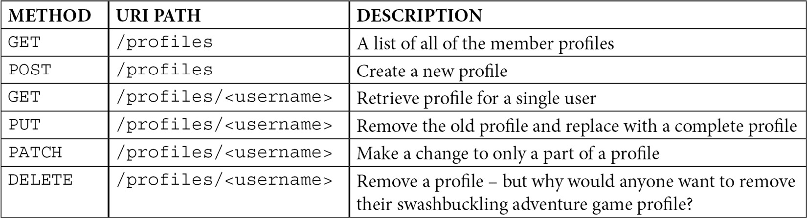

# Routing and Intaking HTTP Requests

## Understanding HTTP methods



## Using HTTP methods on route handlers

### Route
The route is a set of instructions to tell Sanic/Frameworks to send any incoming HTTP requests to our route handler. A route definition must have two parts
- A URI path 
- HTTP methods
```python
@app.route("/my/stuff")
async def stuff_handler(request=None):
  pass
```

```python
@app.route("/my/stuff", methods=["GET", "HEAD"])
async def stuff_handler(request=None):
  return text("Hello")
```

#### Shorthand Techniques
```python
@app.get("/")
def get_handler(request=None):
  pass

@app.post("/")
def post_handler(request=None):
  pass

@app.put("/")
def put_handler(request=None):
  pass

@app.patch("/")
def patch_handler(request=None):
  pass

@app.delete("/")
def delete_handler(request=None):
  pass

@app.head("/")
def head_handler(request=None):
  pass

@app.options("/")
def options_handler(request=None):
  pass
```

#### Using Stacked Route
```python
@app.head("/my/stuff")
@app.get("/my/stuff")
async def stuff_handler(request=None):
  return text("Hello")
```

#### Using add_route
```python
async def stuff_handler(request=None):
  return text("Hello")
app.add_route(stuff_handler, "/my/stuff", methods=["GET", "HEAD"])
```

#### Class-Based Views (CBV)
```python
from sanic.views import HTTPMethodView

class StuffHandler(HTTPMethodView):
    async def get(self, request):
        return text("Hello")

    async def head(self, request):
        return await self.get(request)

app.add_route(StuffHandler.as_view(), "/")
```

#### Using different responses for different HTTP methods
```python
from sanic.response import text, empty
from sanic.constants import HTTPMethod

@app.options("/do/stuff")
@app.post("/do/stuff")
async def stuff_handler(request: Request):
    if request.method == HTTPMethod.OPTIONS:
        return empty()
    else:
        return text("Hello")
```

#### Using Functional definitions
```python
@app.get("/foo")
async def handler_1(request: Request):
  pass
async def handler_2(request: Request):
  pass

app.add_route(handler_2, "/bar")
```

### Advanced method routing
Sanic does not support CONNECT and TRACE out of the box, two standard HTTP methods. But let's imagine that you want to build an HTTP proxy or some other system that needs to have the CONNECT method available in your route handler. Even though Sanic does not allow it out of the box, you have two potential approaches.

#### First Approach
First, we could create a piece of middleware that is on the lookout for CONNECT and hijacks the request to provide a custom response. This trick of responding from middleware is a feature that allows you to halt the execution of the request/response lifecycle before the handlers take over and otherwise fail as a 404 Not Found
```python
async def connect_handler(request: Request):
  return text("connecting...")

@app.on_request
async def method_hijack(request: Request):
  if request.method == "CONNECT":
    return await connect_handler(request)
```

#### Second Approach
A second approach might be to tell the Sanic router that CONNECT is a valid HTTP method. Once we do this, we can add it to a normal request handler
```python
app.router.ALLOWED_METHODS = [*app.router.ALLOWED_METHODS, "CONNECT"]

@app.route("/", methods=["CONNECT"])
async def connect_handler(request: Request):
  return text("connecting...")
```
One important consideration for this strategy is that you will need to redefine app.router.ALLOWED_METHODS as early as possible before registering the new handlers. For this reason, it might be best for it to come directly after app = Sanic(...).

## Method safety and request body
As we have learned, there are generally two types of HTTP methods: safe and unsafe. The unsafe methods are POST, PUT, PATCH, and DELETE. These methods are generally understood to mean that they are state-changing. That is to say that by hitting these endpoints, the user is intending to change or alter the resource in some way.

The converse of this is safe methods: GET, HEAD, and OPTIONS. The purpose of these endpoints is to request information from the application, not to change the state.

It is considered good practice to follow this practice: if an endpoint will make a change on the server, do not use GET.

### DELETE method
It is important to note that Sanic will only take the time to read the message body for POST, PUT, and PATCH requests. It will stop reading the HTTP message after the headers if it is an HTTP request using any other HTTP method. This is a performance optimization since we generally do not expect there to be a message body on the safe HTTP requests.

Sanic assumes that delete will not have one unless you tell it that it does. To do this, we simply set
```python
@app.delete("/", ignore_body=False)
async delete_something(request: Request):
    await delete_something_using_request(request.body)
```
If we do not set ignore_body=False, and we send a body with our DELETE requests, Sanic will raise a warning in the logs to let us know that part of the HTTP message was not consumed. 

## RESTful API design
HTTP methods are often used in RESTful API design. There is a wealth of literature already written on building RESTful APIs,


### BLUEPRINT
```python
from sanic import Blueprint, Request

bp = Blueprint("MemberProfiles", url_prefix="/profile")

@bp.get("")
async def fetch_all_profiles(request: Request):
  pass

@bp.post("")
async def create_new_profile(request: Request):
  pass

@bp.get("/<username>")
async def fetch_single_profile(request: Request, username: str):
  pass

@bp.put("/<username>")
async def replace_profile(request: Request, username: str):
  pass

@bp.patch("/<username>")
async def update_profile(request: Request, username: str):
  pass

@bp.delete("/<username>")
async def delete_profile(request: Request, username: str):
  pass
```

## Simplifying your endpoints with CBVs

When we make some changes to the existing endpoint, it leads to a higher chance that we do not maintain parity among all our route definitions. This is a violation of the **don't repeat yourself (DRY)** principle and could lead to bugs. Maintaining these endpoints over the long term therefore might be more difficult than necessary.
This is one of the compelling reasons to use CBVs.

```python
from sanic import Blueprint, Request, HttpMethodView

bp = Blueprint("MemberProfiles", url_prefix="/profile")

class AllProfilesView(HttpMethodView):

    async def get(request: Request):
        """same as fetch_all_profiles() from before"""

    async def post(request: Request):
        """same as create_new_profile() from before"""

class SingleProfileView(HttpMethodView):

    async def get(request: Request, username: str):
        """same as fetch_single_profile() from before"""

    async def put(request: Request, username: str):
        """same as replace_profile() from before"""

    async def patch(request: Request, username: str):
        """same as update_profile() from before"""

    async def delete(request: Request, username: str):
        """same as delete_profile() from before"""

app.add_route (AllProfilesView.as_view(), "")
app.add_route(SingleProfileView.as_view(), "/<username>")
```

You can also add URI while defining the class.

```python
from sanic import Sanic

app = Sanic.get_app()

class SingleProfileView(HttpMethodView, attach=app, uri="/<username>"):

    async def get(request: Request, username: str):
        """same as fetch_single_profile() from before"""

    async def put(request: Request, username: str):
        """same as replace_profile() from before"""

    async def patch(request: Request, username: str):
        """same as update_profile() from before"""

    async def delete(request: Request, username: str):
        """same as delete_profile() from before"""
```

## Blanket support for OPTIONS and HEAD
It is generally best practice to support the OPTIONS and HEAD methods on all of your endpoints, where it is appropriate. This could become tedious and include a lot of repetitive boilerplates. To achieve this with standard route definitions alone would require a lot of code duplication as seen in the following snippet.
```python
@app.get("/path/to/something")
async def do_something(request: Request):
  ...

@app.post("/path/to/something")
async def do_something(request: Request):
  ...

@app.options("/path/to/something")
async def do_something_options(request: Request):
  ...

@app.head("/path/to/something")
async def do_something_head(request: Request):
  ...
```

We can use Sanic's router to our advantage to add on a handler for these requests to every route. The idea will be to loop over all of the routes defined in our application and dynamically add handlers for OPTIONS and HEAD if needed.
```python
async def options_handler(request: Request):
  ...

async def head_handler(request: Request):
  ...

@app.before_server_start
def add_info_handlers(app: Sanic, _):
  app.router.reset()
  for group in app.router.groups.values():
    if "OPTIONS" not in group.methods:
      app.add_route(
        handler=options_handler,
        uri=group.uri,
        methods=["OPTIONS"],
        strict_slashes=group.strict,
        )
  app.router.finalize()
```

## Extracting information from the path
```python
@app.get("/characters/<name>")
async def profile(request: Request, name: str):
  print text(f"Hello {name}")

@app.get("/messages/<message_id:int>")
async def message_details(request: Request, message_id: int):
  ...
```

Besides extracting information from the path itself, the two other places we may want to look for user data are the query parameters and the request body. Query parameters are the part of the URL that comes after a ?:

<code>/characters?count=10&name=george</code>

Best practices dictate that information should be accessed as follows:

- Path parameters: Information to describe what the resource is we are looking for
- Query parameters: Information that can be used to filter, search, or sort the response
- Request body: Everything else

## Advanced path parameters

### Custom parameter matching
Out of the box, Sanic provides eight path parameter types that can be matched:

- str: Matches any valid string
- slug: Matches standard path slugs
- int: Matches any integer
- float: Matches any number
- alpha: Matches only alphabet characters
- path: Matches any expandable path
- ymd: Matches YYYY-MM-DD
- uuid: Matches a UUID

if you have the path <code>/report/<report_date:ymd></code>, the date object in your handler will be a <code>datetime.date</code> instance:

Let's imagine that we have an endpoint that we want to match on a valid IPv4 address: <code>/ip/1.2.3.4</code>.

The simplest approach here would be to find a relevant regular expression and add it to our path segment definition:
```python
IP_ADDRESS_PATTERN = (
  r"(?:(?:25[0-5]|2[0-4][0-9]|[01]?[0-9][0-9]?)\.){3}"
  r"(?:25[0-5]|2[0-4][0-9]|[01]?[0-9][0-9]?)"
  )

@app.get(f"/<ip:{IP_ADDRESS_PATTERN}>")
async def get_ip_details(request: Request, ip: str):
  return text(f"type={type(ip)} {ip=}")
```

### Using choice/options
```python
@app.get("/icecream/<flavor:vanilla|chocolate>")
async def get_flavor(request: Request, flavor: str):
  return text(f"You chose {flavor}")
```

## API versioning

```python
bp = Blueprint("characters", version=1, url_prefix="/characters")

@bp.get("")
async def get_all_characters(...):
  ...
```

we get the URL path <code>/v1/characters</code>

```python
group = Blueprint.group(bp1, bp2, bp3, version_prefix="/api/v")
```

## Virtual hosts

Some applications can be accessed from multiple domains. This gives the benefit of having a single application deployment to manage, but the ability to service multiple domains.

```python
@bp.route("")
async def do_something(request: Request):
  if request.headers["host"] == "alice.com":
    await do_something_for_alice(request)
  elif request.headers["host"] == "bob.com":
    await do_something_for_bob(request)
  else:
    await do_something_for_me(request)
```

## Serving static content from Sanic

Our app instance has a method on it called <code>app.static()</code>. That method requires two arguments:
- A URI path for our application
- A path to tell Sanic where it can access that resource

That second argument can either be a single file or a directory. If it is a directory, everything inside it will be accessible.

<pre>
.
├── server.py
└── assets
    ├── index.html
    ├── css
    │   └── styles.css
    ├── img
    │   └── logo.png
    └── js
        └── bundle.js
</pre>

We can use Sanic to serve all of those assets and make them accessible like this:

<code>app.static("/static", "./assets")</code>

Those assets are now accessible:

<code>$ curl localhost:7777/static/css/styles.css</code>

## Streaming static content
It is also worth reiterating that the Sanic server is built and intended to be a frontline server. That means that it can certainly stand as your point of ingress without a proxy server in front of it, including serving static content.

Let's create a really simple web page to stream a video and see what that might look like:

1. First, the HTML. Store this as index.html:
```html
<html>
  <head>
    <title>Sample Stream</title>
  </head>
  <body>
    <video width="1280" height="720" controls>
      <source src="/mp4" type="video/mp4" />
    </video>
  </body>
</html>
```

2. Next, find an mp4 file that you want to stream. It can be any video file. If you do not have one, you can download a sample file for free from a website such as this: https://samplelib.com/sample-mp4.html.

3. We will now create a small Sanic app to stream that video:
```python
from sanic import Sanic, response

@app.route("/mp4")
async def handler_file_stream(request: Request):
  return await response.file_stream("/path/to/sample.mp4")

app.static("/index.html", "/path/to/index.html")

@app.route("/")
def redirect(request: Request):
  return response.redirect("/index.html")
```

4. Run the server as normal and visit it in your web browser: http://localhost:7777.

You should notice that the root URI (/) redirected you to <code>/index.html</code>. Using <code>app.static</code>, the application tells Sanic that it should accept any requests to <code>/index.html</code> and serve back the static content that is located on the server at <code>/path/to/index.html</code>. This should be your delivered content from above. Hopefully, you have a play button, and you can now stream your video to your browser. Enjoy!
